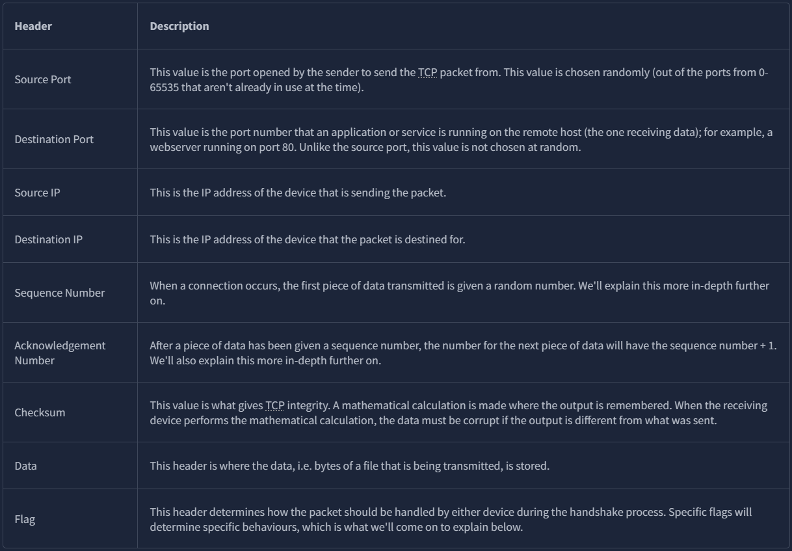
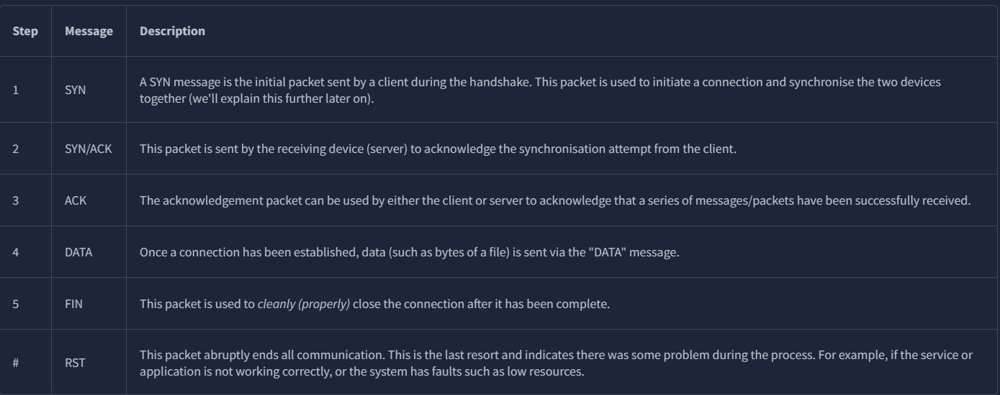
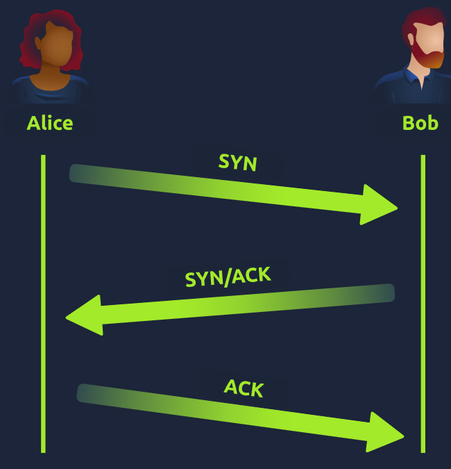
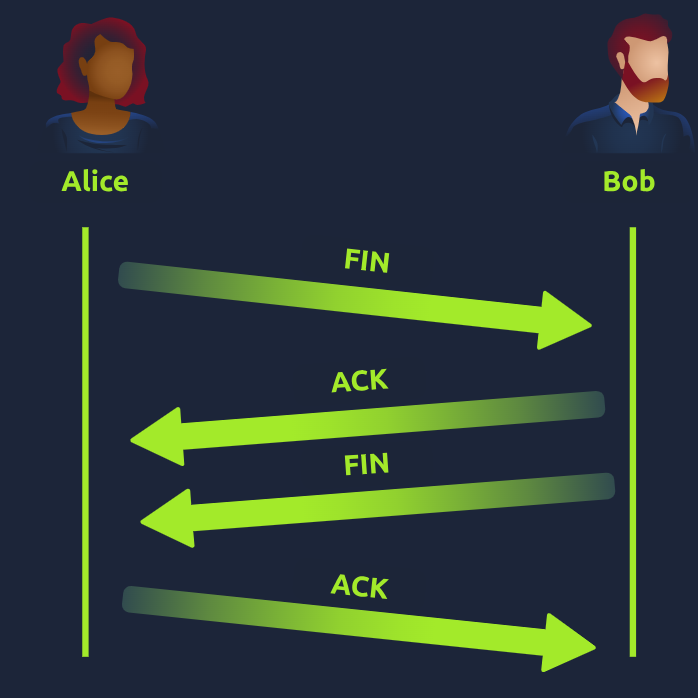
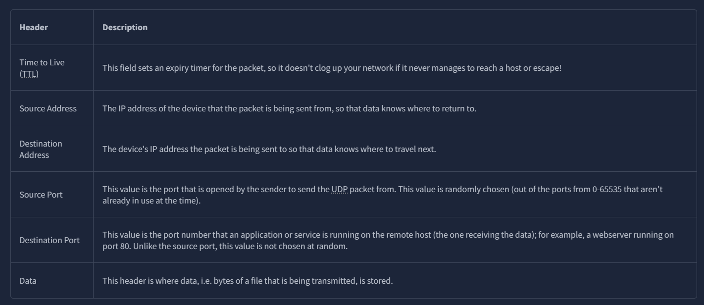
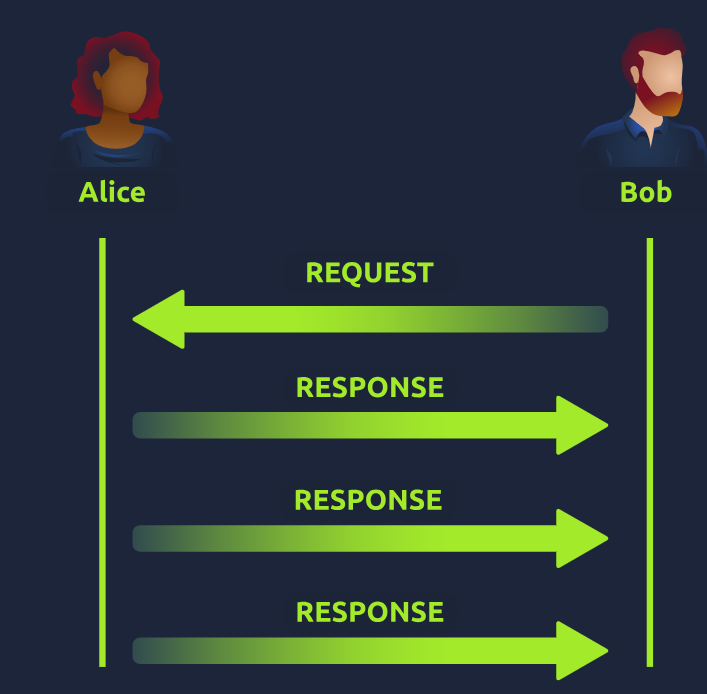

## Packets and frames
- A packet is a unit of data that is transmitted over a network. It contains information such as an IP header and payload
- A frame encapsulates the packet and adds additional information such as MAC addresses.

Some packet headers include:
- Time to Live (TTL) - indicates the maximum time a packet can exist in the network before being discarded
- Source Address - the IP address of the sender
- Destination Address - the IP address of the intended recipient
- Checksum - used for error-checking to ensure data integrity during transmission.

## TCP/IP (Transmission Control Protocol)
- Connection-based
- Ensures data integrity
- Slower than UDP due to the overhead of establishing and maintaining a connection/checking data integrity

### Some TCP headers include

### TCP flags

### Establishing a connection (Three-way handshake)
1. SYN - The client sends a SYN packet to the server to initiate a connection.
2. SYN-ACK - The server responds with a SYN-ACK packet to acknowledge the client's request and indicate that it is ready to establish a connection.
3. ACK - The client sends an ACK packet to the server to acknowledge the server's response and complete the three-way handshake, establishing a connection between the client and server.

### Ending a connection
1. FIN - The client sends a FIN packet to the server to indicate that it wants to terminate the connection.
2. ACK - The server responds with an ACK packet to acknowledge the client's request to terminate the connection.
3. FIN - The server sends a FIN packet to the client to indicate that it also wants to terminate the connection.
4. ACK - The client responds with an ACK packet to acknowledge the server's request to terminate the connection, completing the termination process.

Because TCP reserves system resources on a device, it is best practice to close TCP connections as soon as possible.

## UDP (User Datagram Protocol)
- Connectionless / stateless
- Does not guarantee data integrity
- Faster than TCP due to the lack of overhead associated with establishing and maintaining a connection/checking

### Some UDP headers include

Udp has less headers than TCP.

### UDP Diagram
